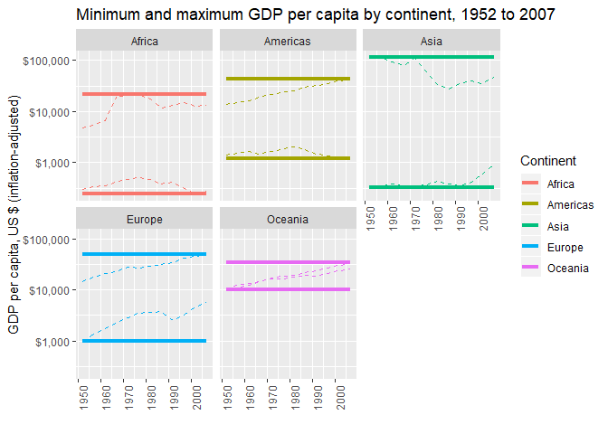
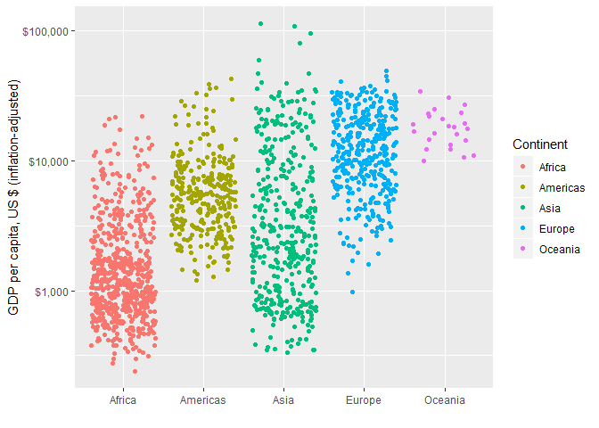
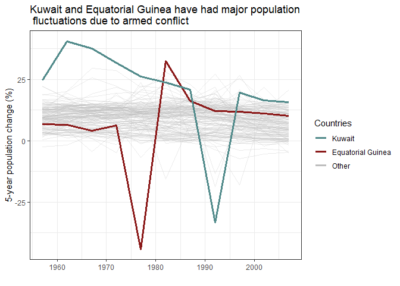

<!--This is to set up the two-column and clearer output formats-->
<style type="text/css">
.twoC {width: 100%}
.clearer {clear: both}
.twoC .table {max-width: 50%; float: right}
.twoC img {max-width: 50%; float: left}
</style>


### Task Option 2
##### Get the maximum and minimum of GDP per capita for all continents.

<div class="twoC">

```r
o2 <- gapminder %>%
        group_by(continent) %>%
        summarize(minGDP=min(gdpPercap) %>% round(digits=0),
                  maxGDP=max(gdpPercap) %>% round(digits=0))
```


```r
o2g <- gapminder %>%
        group_by(continent,year) %>%
        summarize(minGDP_yr=min(gdpPercap) %>% round(digits=0),
                  maxGDP_yr=max(gdpPercap) %>% round(digits=0)) %>% #get annual min and max
        ungroup() %>%
        group_by(continent) %>%
        mutate(minGDP=min(minGDP_yr),
                  maxGDP=max(maxGDP_yr)) %>% #get overall min and max
          ggplot(aes(x=year,y=minGDP_yr, colour=continent)) +
            geom_line(linetype=2) + #annual trend
            geom_line(aes(x=year, y=maxGDP_yr, colour=continent),linetype=2) + #annual trend
            geom_line(aes(x=year,y=minGDP), size=1.5) + #overall min
            geom_line(aes(x=year,y=maxGDP), size=1.5) + #overall max
            scale_y_log10(labels=scales::dollar_format()) +
            theme(axis.text.x = element_text(angle = 90)) +
            labs(x="",
                 y="GDP per capita, US $ (inflation-adjusted)",
                 colour="Continent",
                 title="Minimum and maximum GDP per capita by continent, 1952 to 2007") +
            facet_wrap(~continent)
```

The table and graph here show the minimum and maximum GDP per capita for each continent. The graph has extra information by providing the trend in minimum and maximum GDP per capita over the study period, while the horizontal lines match the table data by showing the absolute minimums and maximums recorded for each continent.

<div class="twoC">

continent    minGDP   maxGDP
----------  -------  -------
Africa          241    21951
Americas       1202    42952
Asia            331   113523
Europe          974    49357
Oceania       10040    34435

<!-- -->
</div>
<div class="clearer"></div>


### Task Option 3
##### Look at the spread of GDP per capita within the continents.


```r
o3 <- gapminder %>%
        group_by(continent) %>%
        summarize(summ=list(c(summary(gdpPercap) %>% round(digits=1)))) %>%
        unnest_wider(summ)
```


```r
o3g <- gapminder %>%
  group_by(continent) %>%
  ggplot(aes(x=continent,y=gdpPercap, colour=continent)) +
  geom_jitter() +
  scale_y_log10(labels=scales::dollar_format()) +
  labs(x="",
       y="GDP per capita, US $ (inflation-adjusted)",
       colour="Continent")
```

The table here shows the statistical summary describing GDP per capita over the 1952 to 2007 period. The graph also illustrates the full range of data plots by using a jittered layout to show every data point in the dataset. The log scale on the graph makes it easier to see detail at the lower end of the y-axis.

<div class="twoC">

continent       Min.   1st Qu.    Median      Mean   3rd Qu.       Max.
----------  --------  --------  --------  --------  --------  ---------
Africa         241.2     761.2    1192.1    2193.8    2377.4    21951.2
Americas      1201.6    3427.8    5465.5    7136.1    7830.2    42951.7
Asia           331.0    1057.0    2646.8    7902.2    8549.3   113523.1
Europe         973.5    7213.1   12081.7   14469.5   20461.4    49357.2
Oceania      10039.6   14141.9   17983.3   18621.6   22214.1    34435.4

<!-- -->
</div>
<div class="clearer"></div>


### Task Option 6
##### Find countries with interesting stories.


```r
#main dataframe for all countries, this is what to graph by
df1 <- gapminder %>%
            group_by(country) %>%
            arrange(year) %>%
            mutate(popChg = tsibble::difference(pop),
                   popChg.pc = tsibble::difference(pop)/pop*100 %>% round(digits=1)) %>%
            drop_na() 
#make a summary dataframe of selected countries and mean of all others
df2 <- df1 %>%
      mutate(Group = ifelse(country=="Kuwait","KW", 
                              ifelse(country=="Equatorial Guinea", "EG", "All"))) %>%
      group_by(Group) %>%
      summarize(chg_1957=mean(popChg.pc[year==1957]) %>% round(1),
                chg_1962=mean(popChg.pc[year==1962]) %>% round(1),
                chg_1967=mean(popChg.pc[year==1967]) %>% round(1),
                chg_1972=mean(popChg.pc[year==1972]) %>% round(1),
                chg_1977=mean(popChg.pc[year==1977]) %>% round(1),
                chg_1982=mean(popChg.pc[year==1982]) %>% round(1),
                chg_1987=mean(popChg.pc[year==1987]) %>% round(1),
                chg_1992=mean(popChg.pc[year==1992]) %>% round(1),
                chg_1997=mean(popChg.pc[year==1997]) %>% round(1),
                chg_2002=mean(popChg.pc[year==2002]) %>% round(1), #its too wide for side-by-side
                chg_2007=mean(popChg.pc[year==2007]) %>% round(1)) #so must transpose below
    
#transposing the data... there must be an easier way
o6 <- df2 %>%
        t() %>% #transpose
        cbind(meanPopChg_Year=names(df2)) %>% #add a names column containing the years
        as_tibble(.name_repair="universal") %>% #make tibble, pre-slice because slice only works on tibble
        slice(-1) %>% #take out the first row, which does not have data
        rename(Other=...1, Eq_Guinea=...2, Kuwait=...3) %>% #rename the other columns
        select(meanPopChg_Year, everything()) %>% #move the ID column to the left
        select(-Other, Other) %>% #move Other to end, match legend order
        mutate_at(.vars=1, .funs=funs(substr(.,nchar(.)-3,nchar(.)))) %>% #keep just the year
        mutate_at(1:4, as.numeric) #change the column classes back to numeric
```


```r
#filtered dataframes for countries of interest
df.eg <- df1 %>% filter(country=="Equatorial Guinea")
df.kw <- df1 %>% filter(country=="Kuwait")

#plot it all together
o6g <-  df1 %>%
          ggplot(aes(y=popChg.pc,x=year,group=country)) +
            geom_line(aes(colour="grey"), alpha=0.3) +
            geom_line(data=df.eg, 
                      aes(y=popChg.pc,x=year,group=country,colour="firebrick4"),  
                      alpha=1, size=1.1) +
            geom_line(data=df.kw, 
                      aes(y=popChg.pc,x=year,group=country, colour="darkslategray4"), 
                      alpha=1, size=1.1) +
            scale_colour_manual(name="Countries", #for colours to be used in legend they need to be called in aes() within geom() functions
                                values=c("darkslategray4","firebrick4","grey"), #order apprently needs to be in reverse of when called
                                labels=c("Kuwait","Equatorial Guinea","Other")) + 
            theme_bw() +
            labs(title="Kuwait and Equatorial Guinea have had major population \n fluctuations due to armed conflict",
                 x="",
                 y="5-year population change (%)")
```

I looked for patterns in population change by country over the course of the dataset. Equatorial Guinea and Kuwait stood out because they both have periods that rank among the highest and lowest 5-year population changes among all countries. This is due to armed conflict, with Equatorial Guinea having a period of political violence and war in the 1970's and Kuwait being in conflict with Iraq in the late 1980's and early 1990's. The table and graph both show percentage change over 5-year periods.

<div class="twoC">

 meanPopChg_Year   Eq_Guinea   Kuwait   Other
----------------  ----------  -------  ------
            1957         6.9     24.8     9.5
            1962         6.5     40.6     9.9
            1967         4.1     37.7    10.1
            1972         6.4     31.7     9.8
            1977       -44.1     26.2     9.8
            1982        32.5     23.8     9.5
            1987        16.3     20.8     9.3
            1992        12.0    -33.4     9.1
            1997        11.8     19.7     8.2
            2002        11.2     16.4     7.6
            2007        10.1     15.7     6.9

<!-- -->
</div>
<div class="clearer"></div>

