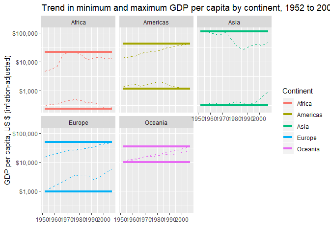

### Task Option 2
- Get the maximum and minimum of GDP per capita for all continents.

__Data table__

```r
gapminder %>%
  group_by(continent) %>%
  summarize(minGDP=min(gdpPercap),
            maxGDP=max(gdpPercap)) %>%
  knitr::kable()
```


continent        minGDP      maxGDP
----------  -----------  ----------
Africa         241.1659    21951.21
Americas      1201.6372    42951.65
Asia           331.0000   113523.13
Europe         973.5332    49357.19
Oceania      10039.5956    34435.37

__Graph__

This graph shows the full spread of data, allowing viewers to see the minimum and maximum values as well as all data points in the middle.

```r
gapminder %>%
  group_by(continent) %>%
  ggplot(aes(x=continent,y=gdpPercap, colour=continent)) +
  geom_jitter() +
  scale_y_log10(labels=scales::dollar_format()) +
  labs(x="",
       y="GDP per capita, US $ (inflation-adjusted)",
       colour="Continent")
```

<!-- -->

