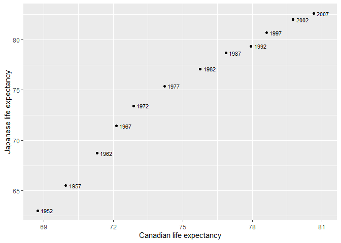

```r
library(tidyverse)
library(tidyr)
library(dplyr)
library(gapminder)
```


### Exercise 1

- Make a tibble with one row per year, and columns for life expectancy for two or more countries.


```r
#part 1
df1 <- gapminder %>%
        pivot_wider( id_cols = year,
                     names_from = "country",
                     values_from = "lifeExp") %>%
        select(year, Canada, Japan)

knitr::kable( df1 )
```


 year   Canada    Japan
-----  -------  -------
 1952   68.750   63.030
 1957   69.960   65.500
 1962   71.300   68.730
 1967   72.130   71.430
 1972   72.880   73.420
 1977   74.210   75.380
 1982   75.760   77.110
 1987   76.860   78.670
 1992   77.950   79.360
 1997   78.610   80.690
 2002   79.770   82.000
 2007   80.653   82.603

- Take advantage of this new data shape to scatterplot life expectancy for one country against that of another.


```r
#part 2
df1 %>%
  ggplot(aes(x=Canada, y=Japan, label=year)) +
    geom_point() +
    labs(x="Canadian life expectancy",
         y="Japanese life expectancy") +
    geom_text(nudge_x = 0.4, size=3)
```

<!-- -->

- Re-lengthen the data.


```r
#part 2
df1 %>%
  pivot_longer( cols=c(Canada, Japan),
                names_to = "country",
                values_to="lifeExp") %>%
  DT::datatable()
```

<!--html_preserve--><div id="htmlwidget-d5aadaa2d0c7e086e7c1" style="width:100%;height:auto;" class="datatables html-widget"></div>
<script type="application/json" data-for="htmlwidget-d5aadaa2d0c7e086e7c1">{"x":{"filter":"none","data":[["1","2","3","4","5","6","7","8","9","10","11","12","13","14","15","16","17","18","19","20","21","22","23","24"],[1952,1952,1957,1957,1962,1962,1967,1967,1972,1972,1977,1977,1982,1982,1987,1987,1992,1992,1997,1997,2002,2002,2007,2007],["Canada","Japan","Canada","Japan","Canada","Japan","Canada","Japan","Canada","Japan","Canada","Japan","Canada","Japan","Canada","Japan","Canada","Japan","Canada","Japan","Canada","Japan","Canada","Japan"],[68.75,63.03,69.96,65.5,71.3,68.73,72.13,71.43,72.88,73.42,74.21,75.38,75.76,77.11,76.86,78.67,77.95,79.36,78.61,80.69,79.77,82,80.653,82.603]],"container":"<table class=\"display\">\n  <thead>\n    <tr>\n      <th> <\/th>\n      <th>year<\/th>\n      <th>country<\/th>\n      <th>lifeExp<\/th>\n    <\/tr>\n  <\/thead>\n<\/table>","options":{"columnDefs":[{"className":"dt-right","targets":[1,3]},{"orderable":false,"targets":0}],"order":[],"autoWidth":false,"orderClasses":false}},"evals":[],"jsHooks":[]}</script><!--/html_preserve-->


### Exercise 2

- Compute some measure of life expectancy and GDP per capita (or two other numeric variables) (mean? median? min? max?) for all possible combinations of continent and year. Reshape that to have one row per year and one variable for each continent-measurement combination. Or the other way around: one row per continent and one variable for each year-measurement combination.


```r
df2 <- gapminder %>%
        group_by(continent, year) %>%
        summarize(min.GDP = min(gdpPercap) %>% round(digits=2),
               min.lifeExp = min(lifeExp)%>% round(digits=1)) %>%
        pivot_wider( id_cols = year,
                     names_from = "continent",
                     values_from = c("min.GDP", "min.lifeExp"))

DT::datatable( df2 )
```

<!--html_preserve--><div id="htmlwidget-2991899395880b3a3cc3" style="width:100%;height:auto;" class="datatables html-widget"></div>
<script type="application/json" data-for="htmlwidget-2991899395880b3a3cc3">{"x":{"filter":"none","data":[["1","2","3","4","5","6","7","8","9","10","11","12"],[1952,1957,1962,1967,1972,1977,1982,1987,1992,1997,2002,2007],[298.85,336,355.2,412.98,464.1,502.32,462.21,389.88,410.9,312.19,241.17,277.55],[1397.72,1544.4,1662.14,1452.06,1654.46,1874.3,2011.16,1823.02,1456.31,1341.73,1270.36,1201.64],[331,350,388,349,357,371,424,385,347,415,611,944],[973.53,1353.99,1709.68,2172.35,2860.17,3528.48,3630.88,3738.93,2497.44,3193.05,4604.21,5937.03],[10039.6,10949.65,12217.23,14463.92,16046.04,16233.72,17632.41,19007.19,18363.32,21050.41,23189.8,25185.01],[30,31.6,32.8,34.1,35.4,36.8,38.4,39.9,23.6,36.1,39.2,39.6],[37.6,40.7,43.4,45,46.7,49.9,51.5,53.6,55.1,56.7,58.1,60.9],[28.8,30.3,32,34,36.1,31.2,39.9,40.8,41.7,41.8,42.1,43.8],[43.6,48.1,52.1,54.3,57,59.5,61,63.1,66.1,68.8,70.8,71.8],[69.1,70.3,70.9,71.1,71.9,72.2,73.8,74.3,76.3,77.5,79.1,80.2]],"container":"<table class=\"display\">\n  <thead>\n    <tr>\n      <th> <\/th>\n      <th>year<\/th>\n      <th>min.GDP_Africa<\/th>\n      <th>min.GDP_Americas<\/th>\n      <th>min.GDP_Asia<\/th>\n      <th>min.GDP_Europe<\/th>\n      <th>min.GDP_Oceania<\/th>\n      <th>min.lifeExp_Africa<\/th>\n      <th>min.lifeExp_Americas<\/th>\n      <th>min.lifeExp_Asia<\/th>\n      <th>min.lifeExp_Europe<\/th>\n      <th>min.lifeExp_Oceania<\/th>\n    <\/tr>\n  <\/thead>\n<\/table>","options":{"columnDefs":[{"className":"dt-right","targets":[1,2,3,4,5,6,7,8,9,10,11]},{"orderable":false,"targets":0}],"order":[],"autoWidth":false,"orderClasses":false}},"evals":[],"jsHooks":[]}</script><!--/html_preserve-->


- Re-lengthen the data.


```r
df2 %>%
  pivot_longer(cols=-year,
               names_to = c(".value", "continent"),
               names_sep="_") %>%
  DT::datatable()
```

<!--html_preserve--><div id="htmlwidget-ee45faf57440b59744ba" style="width:100%;height:auto;" class="datatables html-widget"></div>
<script type="application/json" data-for="htmlwidget-ee45faf57440b59744ba">{"x":{"filter":"none","data":[["1","2","3","4","5","6","7","8","9","10","11","12","13","14","15","16","17","18","19","20","21","22","23","24","25","26","27","28","29","30","31","32","33","34","35","36","37","38","39","40","41","42","43","44","45","46","47","48","49","50","51","52","53","54","55","56","57","58","59","60"],[1952,1952,1952,1952,1952,1957,1957,1957,1957,1957,1962,1962,1962,1962,1962,1967,1967,1967,1967,1967,1972,1972,1972,1972,1972,1977,1977,1977,1977,1977,1982,1982,1982,1982,1982,1987,1987,1987,1987,1987,1992,1992,1992,1992,1992,1997,1997,1997,1997,1997,2002,2002,2002,2002,2002,2007,2007,2007,2007,2007],["Africa","Americas","Asia","Europe","Oceania","Africa","Americas","Asia","Europe","Oceania","Africa","Americas","Asia","Europe","Oceania","Africa","Americas","Asia","Europe","Oceania","Africa","Americas","Asia","Europe","Oceania","Africa","Americas","Asia","Europe","Oceania","Africa","Americas","Asia","Europe","Oceania","Africa","Americas","Asia","Europe","Oceania","Africa","Americas","Asia","Europe","Oceania","Africa","Americas","Asia","Europe","Oceania","Africa","Americas","Asia","Europe","Oceania","Africa","Americas","Asia","Europe","Oceania"],[298.85,1397.72,331,973.53,10039.6,336,1544.4,350,1353.99,10949.65,355.2,1662.14,388,1709.68,12217.23,412.98,1452.06,349,2172.35,14463.92,464.1,1654.46,357,2860.17,16046.04,502.32,1874.3,371,3528.48,16233.72,462.21,2011.16,424,3630.88,17632.41,389.88,1823.02,385,3738.93,19007.19,410.9,1456.31,347,2497.44,18363.32,312.19,1341.73,415,3193.05,21050.41,241.17,1270.36,611,4604.21,23189.8,277.55,1201.64,944,5937.03,25185.01],[30,37.6,28.8,43.6,69.1,31.6,40.7,30.3,48.1,70.3,32.8,43.4,32,52.1,70.9,34.1,45,34,54.3,71.1,35.4,46.7,36.1,57,71.9,36.8,49.9,31.2,59.5,72.2,38.4,51.5,39.9,61,73.8,39.9,53.6,40.8,63.1,74.3,23.6,55.1,41.7,66.1,76.3,36.1,56.7,41.8,68.8,77.5,39.2,58.1,42.1,70.8,79.1,39.6,60.9,43.8,71.8,80.2]],"container":"<table class=\"display\">\n  <thead>\n    <tr>\n      <th> <\/th>\n      <th>year<\/th>\n      <th>continent<\/th>\n      <th>min.GDP<\/th>\n      <th>min.lifeExp<\/th>\n    <\/tr>\n  <\/thead>\n<\/table>","options":{"columnDefs":[{"className":"dt-right","targets":[1,3,4]},{"orderable":false,"targets":0}],"order":[],"autoWidth":false,"orderClasses":false}},"evals":[],"jsHooks":[]}</script><!--/html_preserve-->

### Exercise 3


#### 3.1

For each guest in the guestlist (guest tibble), add a column for email address, which can be found in the email tibble.


```r
email2 <- email %>% 
            separate_rows(guest, sep = ", ") %>%
            rename(name=guest)

left_join(guest, email2, by="name") %>%
  DT::datatable()
```

<!--html_preserve--><div id="htmlwidget-e0b9ba9b56edf83e1716" style="width:100%;height:auto;" class="datatables html-widget"></div>
<script type="application/json" data-for="htmlwidget-e0b9ba9b56edf83e1716">{"x":{"filter":"none","data":[["1","2","3","4","5","6","7","8","9","10","11","12","13","14","15","16","17","18","19","20","21","22","23","24","25","26","27","28","29","30"],[1,1,1,1,2,2,3,4,5,5,5,6,6,7,7,8,9,10,11,12,12,12,12,12,13,13,14,14,15,15],["Sommer Medrano","Phillip Medrano","Blanka Medrano","Emaan Medrano","Blair Park","Nigel Webb","Sinead English","Ayra Marks","Atlanta Connolly","Denzel Connolly","Chanelle Shah","Jolene Welsh","Hayley Booker","Amayah Sanford","Erika Foley","Ciaron Acosta","Diana Stuart","Cosmo Dunkley","Cai Mcdaniel","Daisy-May Caldwell","Martin Caldwell","Violet Caldwell","Nazifa Caldwell","Eric Caldwell","Rosanna Bird","Kurtis Frost","Huma Stokes","Samuel Rutledge","Eddison Collier","Stewart Nicholls"],["PENDING","vegetarian","chicken","PENDING","chicken",null,"PENDING","vegetarian","PENDING","fish","chicken",null,"vegetarian",null,"PENDING","PENDING","vegetarian","PENDING","fish","chicken","PENDING","PENDING","chicken","chicken","vegetarian","PENDING",null,"chicken","PENDING","chicken"],["PENDING","Menu C","Menu A","PENDING","Menu C",null,"PENDING","Menu B","PENDING","Menu B","Menu C",null,"Menu C","PENDING","PENDING","Menu A","Menu C","PENDING","Menu C","Menu B","PENDING","PENDING","PENDING","Menu B","Menu C","PENDING",null,"Menu C","PENDING","Menu B"],["PENDING","CONFIRMED","CONFIRMED","PENDING","CONFIRMED","CANCELLED","PENDING","PENDING","PENDING","CONFIRMED","CONFIRMED","CANCELLED","CONFIRMED","CANCELLED","PENDING","PENDING","CONFIRMED","PENDING","CONFIRMED","CONFIRMED","PENDING","PENDING","PENDING","CONFIRMED","CONFIRMED","PENDING","CANCELLED","CONFIRMED","PENDING","CONFIRMED"],["PENDING","CONFIRMED","CONFIRMED","PENDING","CONFIRMED","CANCELLED","PENDING","PENDING","PENDING","CONFIRMED","CONFIRMED","CANCELLED","CONFIRMED","PENDING","PENDING","PENDING","CONFIRMED","PENDING","CONFIRMED","CONFIRMED","PENDING","PENDING","PENDING","CONFIRMED","CONFIRMED","PENDING","CANCELLED","CONFIRMED","PENDING","CONFIRMED"],["PENDING","CONFIRMED","CONFIRMED","PENDING","CONFIRMED","CANCELLED","PENDING","PENDING","PENDING","CONFIRMED","CONFIRMED","CANCELLED","CONFIRMED","PENDING","PENDING","PENDING","CONFIRMED","PENDING","CONFIRMED","CONFIRMED","PENDING","PENDING","PENDING","CONFIRMED","CONFIRMED","PENDING","CANCELLED","CONFIRMED","PENDING","CONFIRMED"],["sommm@gmail.com","sommm@gmail.com","sommm@gmail.com","sommm@gmail.com","bpark@gmail.com","bpark@gmail.com","singlish@hotmail.ca","marksa42@gmail.com",null,null,null,"jw1987@hotmail.com","jw1987@hotmail.com","erikaaaaaa@gmail.com","erikaaaaaa@gmail.com","shining_ciaron@gmail.com","doodledianastu@gmail.com",null,null,"caldwellfamily5212@gmail.com","caldwellfamily5212@gmail.com","caldwellfamily5212@gmail.com","caldwellfamily5212@gmail.com","caldwellfamily5212@gmail.com","rosy1987b@gmail.com","rosy1987b@gmail.com","humastokes@gmail.com","humastokes@gmail.com","eddison.collier@gmail.com","eddison.collier@gmail.com"]],"container":"<table class=\"display\">\n  <thead>\n    <tr>\n      <th> <\/th>\n      <th>party<\/th>\n      <th>name<\/th>\n      <th>meal_wedding<\/th>\n      <th>meal_brunch<\/th>\n      <th>attendance_wedding<\/th>\n      <th>attendance_brunch<\/th>\n      <th>attendance_golf<\/th>\n      <th>email<\/th>\n    <\/tr>\n  <\/thead>\n<\/table>","options":{"columnDefs":[{"className":"dt-right","targets":1},{"orderable":false,"targets":0}],"order":[],"autoWidth":false,"orderClasses":false}},"evals":[],"jsHooks":[]}</script><!--/html_preserve-->

#### 3.2

Who do we have emails for, yet are not on the guestlist?


```r
anti_join(email2, guest, by="name") %>%
  knitr::kable()
```


name              email                           
----------------  --------------------------------
Turner Jones      tjjones12@hotmail.ca            
Albert Marshall   themarshallfamily1234@gmail.com 
Vivian Marshall   themarshallfamily1234@gmail.com 

#### 3.3

Make a guestlist that includes everyone we have emails for (in addition to those on the original guestlist).


```r
full_join(guest, email2, by="name") %>%
  arrange(party) %>%
  DT::datatable()
```

<!--html_preserve--><div id="htmlwidget-16a0c7da57dfbb5df59e" style="width:100%;height:auto;" class="datatables html-widget"></div>
<script type="application/json" data-for="htmlwidget-16a0c7da57dfbb5df59e">{"x":{"filter":"none","data":[["1","2","3","4","5","6","7","8","9","10","11","12","13","14","15","16","17","18","19","20","21","22","23","24","25","26","27","28","29","30","31","32","33"],[1,1,1,1,2,2,3,4,5,5,5,6,6,7,7,8,9,10,11,12,12,12,12,12,13,13,14,14,15,15,null,null,null],["Sommer Medrano","Phillip Medrano","Blanka Medrano","Emaan Medrano","Blair Park","Nigel Webb","Sinead English","Ayra Marks","Atlanta Connolly","Denzel Connolly","Chanelle Shah","Jolene Welsh","Hayley Booker","Amayah Sanford","Erika Foley","Ciaron Acosta","Diana Stuart","Cosmo Dunkley","Cai Mcdaniel","Daisy-May Caldwell","Martin Caldwell","Violet Caldwell","Nazifa Caldwell","Eric Caldwell","Rosanna Bird","Kurtis Frost","Huma Stokes","Samuel Rutledge","Eddison Collier","Stewart Nicholls","Turner Jones","Albert Marshall","Vivian Marshall"],["PENDING","vegetarian","chicken","PENDING","chicken",null,"PENDING","vegetarian","PENDING","fish","chicken",null,"vegetarian",null,"PENDING","PENDING","vegetarian","PENDING","fish","chicken","PENDING","PENDING","chicken","chicken","vegetarian","PENDING",null,"chicken","PENDING","chicken",null,null,null],["PENDING","Menu C","Menu A","PENDING","Menu C",null,"PENDING","Menu B","PENDING","Menu B","Menu C",null,"Menu C","PENDING","PENDING","Menu A","Menu C","PENDING","Menu C","Menu B","PENDING","PENDING","PENDING","Menu B","Menu C","PENDING",null,"Menu C","PENDING","Menu B",null,null,null],["PENDING","CONFIRMED","CONFIRMED","PENDING","CONFIRMED","CANCELLED","PENDING","PENDING","PENDING","CONFIRMED","CONFIRMED","CANCELLED","CONFIRMED","CANCELLED","PENDING","PENDING","CONFIRMED","PENDING","CONFIRMED","CONFIRMED","PENDING","PENDING","PENDING","CONFIRMED","CONFIRMED","PENDING","CANCELLED","CONFIRMED","PENDING","CONFIRMED",null,null,null],["PENDING","CONFIRMED","CONFIRMED","PENDING","CONFIRMED","CANCELLED","PENDING","PENDING","PENDING","CONFIRMED","CONFIRMED","CANCELLED","CONFIRMED","PENDING","PENDING","PENDING","CONFIRMED","PENDING","CONFIRMED","CONFIRMED","PENDING","PENDING","PENDING","CONFIRMED","CONFIRMED","PENDING","CANCELLED","CONFIRMED","PENDING","CONFIRMED",null,null,null],["PENDING","CONFIRMED","CONFIRMED","PENDING","CONFIRMED","CANCELLED","PENDING","PENDING","PENDING","CONFIRMED","CONFIRMED","CANCELLED","CONFIRMED","PENDING","PENDING","PENDING","CONFIRMED","PENDING","CONFIRMED","CONFIRMED","PENDING","PENDING","PENDING","CONFIRMED","CONFIRMED","PENDING","CANCELLED","CONFIRMED","PENDING","CONFIRMED",null,null,null],["sommm@gmail.com","sommm@gmail.com","sommm@gmail.com","sommm@gmail.com","bpark@gmail.com","bpark@gmail.com","singlish@hotmail.ca","marksa42@gmail.com",null,null,null,"jw1987@hotmail.com","jw1987@hotmail.com","erikaaaaaa@gmail.com","erikaaaaaa@gmail.com","shining_ciaron@gmail.com","doodledianastu@gmail.com",null,null,"caldwellfamily5212@gmail.com","caldwellfamily5212@gmail.com","caldwellfamily5212@gmail.com","caldwellfamily5212@gmail.com","caldwellfamily5212@gmail.com","rosy1987b@gmail.com","rosy1987b@gmail.com","humastokes@gmail.com","humastokes@gmail.com","eddison.collier@gmail.com","eddison.collier@gmail.com","tjjones12@hotmail.ca","themarshallfamily1234@gmail.com","themarshallfamily1234@gmail.com"]],"container":"<table class=\"display\">\n  <thead>\n    <tr>\n      <th> <\/th>\n      <th>party<\/th>\n      <th>name<\/th>\n      <th>meal_wedding<\/th>\n      <th>meal_brunch<\/th>\n      <th>attendance_wedding<\/th>\n      <th>attendance_brunch<\/th>\n      <th>attendance_golf<\/th>\n      <th>email<\/th>\n    <\/tr>\n  <\/thead>\n<\/table>","options":{"columnDefs":[{"className":"dt-right","targets":1},{"orderable":false,"targets":0}],"order":[],"autoWidth":false,"orderClasses":false}},"evals":[],"jsHooks":[]}</script><!--/html_preserve-->

