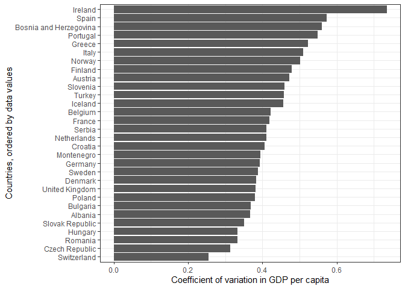

```r
knitr::opts_chunk$set(echo = TRUE)

library(tidyverse)
library(gapminder)
library(forcats)
library(here)
```

<!--This is to set up the two-column and clearer output formats-->
<style type="text/css">
.twoC {width: 100%}
.clearer {clear: both}
.twoC .table {max-width: 50%; float: right}
.twoC img {max-width: 50%; float: left}
</style>
<!-- end two-column setup -->


## Exercise 1: The value of the here::here package

Setting working directories is not as straightforward as it seems. If someone else wants to run code that has its working directory defined with `setwd()`, then they will need to have the same folder structure as the originating computer. Likewise if you get a new computer, or move your work to another folder. There are additional compatibility problems when switching between operating systems as some use `\\` to separate folders in file paths, and others use `/`. There are additional inconsistenciegs between how `.R` files and `.Rmd` files deal with working directories.

It is a big hassle to have to overwrite working directories manually within scripts, especially if `setwd()` is called numerous times.

The `here` package provides a solution to these issues by providing a platform-agnostic way to set working directories and define file paths. With `here`, working directories and file paths are set relative to each user's file structure and operating system. The working directory when using `here` is defined based on simple rules, such as where a `.here` file was made using the function `here::set_here()`, or where an `.Rproj` file exists in the current folder structure. By opening projects via `.Rproj` files and using `here::here` within scripts, any computer access the script via the `.Rproj` file will be able to seamlessly access and write files within that script using the folder structure and operating system that exists locally. 

_`here` makes work easily transferable, and readily reproducible, which should be a goal in all data analyses._


## Exercise 2: Factor management

__Task:__ Choose one dataset (of your choice) and a variable to explore. After ensuring the variable(s) you’re exploring are indeed factors, you should:

    Drop factor / levels;
    Reorder levels based on knowledge from data.

Explore the effects of re-leveling a factor in a tibble by:

    comparing the results of arrange on the original and re-leveled factor.
    Plotting a figure of before/after re-leveling the factor (make sure to assign the factor to an aesthetic of your choosing).

#### Gapminder option

__Drop Oceania.__ _Filter the Gapminder data to remove observations associated with the continent of Oceania. Additionally, remove unused factor levels. Provide concrete information on the data before and after removing these rows and Oceania; address the number of rows and the levels of the affected factors._

The code chunk below ensures that the `gapminder$continent` column is indeed a factor:

```r
#ensure that the column is a factor
gapminder$continent %>% class()
```

```
## [1] "factor"
```

The code chunk below provides a look at factor levels in `gapminder`before Oceania is dropped from the continent column. There are actually two factor columns in `gapminder`: continent and country. If we were dropping Oceania from the dataset for further analysis, it would be important to also remove Oceania-associated factor levels from the country column, as they will have no associated obervations (i.e. rows) remaining, so these will be dealt with as well in the following steps. 

```r
#look at unique levels of gapminder$continent before removing Oceania:
gapminder$continent %>% levels()
```

```
## [1] "Africa"   "Americas" "Asia"     "Europe"   "Oceania"
```

```r
#we have 5 levels in the continent column beforehand:
gapminder$continent %>% nlevels()
```

```
## [1] 5
```

```r
#there also Oceania-associated factor levels (i.e. countries) in gapminder$country:
gapminder %>%
  group_by(continent) %>%
  summarize(n_country = unique(country) %>% length())
```

```
## # A tibble: 5 x 2
##   continent n_country
##   <fct>         <int>
## 1 Africa           52
## 2 Americas         25
## 3 Asia             33
## 4 Europe           30
## 5 Oceania           2
```

```r
#these two countries in Oceania are Australia and New Zealand:
gapminder %>%
  filter(continent=="Oceania") %>%
  select(country) %>%
  unique()
```

```
## # A tibble: 2 x 1
##   country    
##   <fct>      
## 1 Australia  
## 2 New Zealand
```

This chunk of code removes the Oceania rows from the dataset using the `filter()` function, and then drops all unused levels from all factor columns (i.e. country and continent) using the `droplevels()` function:

```r
#this is the step to drop Oceania and associated factor levels from the dataset
gapminder_drop <- gapminder %>%
                    filter(continent!="Oceania") %>%
                    droplevels()
```


This last code chunk from this task shows in multiple ways that Oceania has been dropped, as have associated factor levels from both the country and continent columns:

```r
#this shows that now Oceania is not one of the levels in the continent column:
gapminder_drop$continent %>% levels()
```

```
## [1] "Africa"   "Americas" "Asia"     "Europe"
```

```r
#and this code outputting zero rows further confirms that Oceania is no longer in the dataset:
gapminder_drop %>% filter(continent == "Oceania")
```

```
## # A tibble: 0 x 6
## # ... with 6 variables: country <fct>, continent <fct>, year <int>,
## #   lifeExp <dbl>, pop <int>, gdpPercap <dbl>
```

```r
#this shows that there are no more countries in the dataset from the Oceania continent:
gapminder_drop %>%
  group_by(continent) %>%
  summarize(n_country = unique(country) %>% length())
```

```
## # A tibble: 4 x 2
##   continent n_country
##   <fct>         <int>
## 1 Africa           52
## 2 Americas         25
## 3 Asia             33
## 4 Europe           30
```

```r
#and this code outputting zero rows further confirms that Australia and New Zealand are no longer in the dataset:
gapminder_drop %>% filter(country %in% c("Australia", "New Zealand"))
```

```
## # A tibble: 0 x 6
## # ... with 6 variables: country <fct>, continent <fct>, year <int>,
## #   lifeExp <dbl>, pop <int>, gdpPercap <dbl>
```

If, for some reason, you only wanted to drop the Oceania factor level from the continent column but keep the now empty factor levels in the country column, you could use `forcats::fct_drop()` as in the code chunk below:

```r
#This drops Oceania from the dataset and removes only unused factor levels in the continent column:
gapminder_drop2 <- gapminder %>%
                    filter(continent != "Oceania") %>%
                    mutate(continent=forcats::fct_drop(continent))

#now we can see that Oceania is no longer present in the continent factor levels:
gapminder_drop2$continent %>% levels()
```

```
## [1] "Africa"   "Americas" "Asia"     "Europe"
```

```r
#but Australia and NZ are still in the country factor levels, as shown by the number of country levels in the new tibble being the same as in the original gapminder tibble:
gapminder_drop2$country %>% nlevels() == gapminder$country %>% nlevels()
```

```
## [1] TRUE
```

```r
#further proof the Australia and NZ levels still exist:
country_levels <- gapminder_drop2$country %>% levels()
which(country_levels %in% c("Australia", "New Zealand")) %>% length()
```

```
## [1] 2
```

```r
#this is despite the Australia and NZ rows no longer being part of the dataset's rows, as shown by this code returning zero rows:
gapminder_drop2 %>% filter(country %in% c("Australia", "New Zealand"))
```

```
## # A tibble: 0 x 6
## # ... with 6 variables: country <fct>, continent <fct>, year <int>,
## #   lifeExp <dbl>, pop <int>, gdpPercap <dbl>
```


__Reorder the levels of country or continent.__ _Use the forcats package to change the order of the factor levels, based on summarized information of one of the quantitative variables. Consider experimenting with a summary statistic beyond the most basic choice of the mean/median. Use the forcats package in the tidyverse for this, rather than the baseR function as.factor._

Reordering factor levels is helpful if you are making graphs with a categorical (i.e. factor-based) axis and want a sensible order for display. Without doing this, the graphed summary data would be displayed in disarray. For this taskI have chosen to reorder and display data by the magntiude of their coefficients of variation in per-capita GDP. 

In order to do this, I first had to make a simple function to compute the coefficient of variation, which is equal to the standard deviation divided by the mean.

```r
#define coefficient of variation function
coeff_var <- function(x){ sd(x) / mean(x) }
```

In the code chunk below, the order of the country factor levels is changed based on the coefficent of variation in per-capita GDP observed for each country. I also made a new column holding the country column as it was given (country_asGiven), in order to use it for the example graphs below.

In order to do this, I first had to make a simple function to compute the coefficient of variation, which is equal to the standard deviation divided by the mean.

```r
#reorder the factor according to the coefficent of variation
gm_reord <- gapminder %>%
              mutate(country_asGiven = country) %>% #this line just duplicates the country column as given, preserving the old factor order
              mutate(country = forcats::fct_reorder(country, gdpPercap, coeff_var)) #this line reorders the country factor levels according to the size of the GDP coefficient of variation
```

To make the example graphs more readable, I first filtered it down to countries in Europe, but this would be applicable if you were keeping all countries, as well. Since I dropped countries by filtering down to Europe, this required me to drop unused factor levels:

```r
#filter and drop unused factor levels, in order to make graph more legible.
gm_reord_drop <- gm_reord %>%
                  filter(continent == "Europe") %>% #filter to Europe only
                  droplevels() %>% #drop unused factor levels, to get rid of non-European countries and continents
                  group_by(country, country_asGiven) %>% #group data by country (both forms) for the summarize function below
                  #group_by(country) %>% #group data by country (both forms) for the summarize function below
                  #summarize(GDP_cv = coeff_var(gdpPercap)) %>% #summarize down to one column of the GDP coeff_var values to graph by
                  summarize(GDP_cv = sd(gdpPercap)) %>% #summarize down to one column of the GDP coeff_var values to graph by
                  ungroup()
```

This first graph has its countries out of order relative to their summary data values, and it is hard to interpret:

```r
#this graph is hard to interpret:
gm_reord_drop %>%
  ggplot() +
    geom_col(aes(x = country_asGiven, #x axis is the non-reordered country levels, which are still alphabetical
                 y = GDP_cv)) + #bar size is based on max GDP for each country
    coord_flip() + #flip the graph to be displayed horizontally
    theme_bw() + #nicer black and white theme
    labs(x = "Countries, default alphabetical order",
         y = "Coefficient of variation in GDP per capita") #make better y label
```

<!-- -->

This next graph is based on the same data, but uses the column of reordered countries, and is therefore more easily interpreted. Ireland has the highest variation in its GDP data, while Switzerland had the most stable data according to the coefficent of variation metric.

```r
#this graph is easy to intepret:
gm_reord_drop %>%
  ggplot() +
    geom_col(aes(x = country, #x axis is the reordered country levels based on max(GDP)
                 y = GDP_cv)) + #bar size is based on max GDP for each country
    coord_flip() + #flip the graph to be displayed horizontally
    theme_bw() + #nicer black and white theme
    labs(x = "Countries, ordered by data values",
         y = "Coefficient of variation in GDP per capita") #make better y label
```

<!-- -->


## Exercise 3: File input/output (I/O)

_Task:_ Experiment with at least one of:

    write_csv()/read_csv() (and/or TSV friends),
    saveRDS()/readRDS(),
    dput()/dget().

You are expected to create something new, probably by filtering or grouped-summarization of your dataset (for e.g., Singer, Gapminder, or another dataset), export it to disk and then reload it back in using one of the packages above. You should use here::here() for reading in and writing out.

With the imported data, play around with factor levels and use factors to order your data with one of your factors (i.e. non-alphabetically). For the I/O method(s) you chose, comment on whether or not your newly created file survived the round trip of writing to file then reading back in.

#### My work

I will do this exercise by looking at the relative variation in life expectancy, as summarized by the coefficient of variation (CV) metric. In this code chunk below, I am getting the CV for each country's life expectancy data over the 1952 to 2007 dataset period. I have grouped by both country and continent to keep 2 factors in play for the final step after writing and reading the object via RDS files.

```r
gm_summary <- gapminder %>%
                group_by(country, continent) %>%
                summarize(lifeExp_cv = coeff_var(lifeExp)) %>%
                ungroup()
```

In this code chunk below, I need to use the here::here package to write and read the file I want to create in a consistent way:

```r
#this tells me that my root directory is my 'stat545-hw-trevor-baker' folder
here::here() 
```

```
## [1] "C:/Users/tbake/Documents/UBC/STAT 545/git/stat545-hw-trevor-baker"
```

```r
#this tells me why here has determined that to be the case -- it is because of the .Rproj file in that folder:
here::dr_here()
```

```
## here() starts at C:/Users/tbake/Documents/UBC/STAT 545/git/stat545-hw-trevor-baker, because it contains a file matching `[.]Rproj$` with contents matching `^Version: ` in the first line
```

```r
#this sets the full file path and name that I will write to, which I want to be in my Assignment_05 folder, two levels up from the here root folder
file.loc <- here::here("Assignments","Assignment_05","hw05-gm_summary.RDS")
```

The work above to set up the `file.loc` variable that holds my full file path and name can now be used to write and read the file in a reproducible way:

```r
#save the file using saveRDS()
saveRDS(gm_summary, file.loc)

#just to prove that the file is really read in, I will read it to a new object name 'gm_input'
gm_input <- readRDS(file.loc)

#this new file is identical to the one I created as gm_summary:
identical(gm_input, gm_summary)
```

```
## [1] TRUE
```
__I was successful in saving the file and then reading it back!__


Now I can manipulate the new tibble by filtering down to just Asia and adjusting the order of its factor levels. Here I'm aiming to organize the country levels according to the coefficient of variation, but I really want to have Cambodia first in my graph display.

```r
#manipulate factor levels
gm_manip <- gm_input %>%
              filter(continent=="Asia") %>% #Asia only
              mutate(country = forcats::fct_reorder(country, lifeExp_cv, max)) %>% #order country levels by the CV values
              mutate(country = forcats::fct_relevel(country, "Cambodia")) #but put Cambodia first in the country levels

#check that this worked to have Cambodia first by checking the first six levels using 'head()':
gm_manip$country %>% levels() %>% head()
```

```
## [1] "Cambodia"  "Israel"    "Sri Lanka" "Lebanon"   "Taiwan"    "Japan"
```

```r
#make a nice plot showing the reordered factor levels
lifeExp_plot <- gm_manip %>%
                  ggplot(aes(x = country, 
                             y = lifeExp_cv, 
                             fill = country=="Cambodia")) + #fill Cambodia differently that others to highlight it
                    geom_col() +
                    coord_flip() + #flip so that graph is displayed horizontally
                    theme_bw() + # nicer black and white theme
                    theme(legend.position = "none") + #remove the legend
                    labs(y= "Coefficient of variation in life expectancy", #make clean x axis title
                         x = "") #remove label on country axis, redundant

#display the plot
lifeExp_plot
```

<!-- -->

```r
#save the plot using here::here and ggsave()
file.loc.plot <- here::here("Assignments", "Assignment_05", "hw05-lifeExp_plot.png")
ggsave(filename = file.loc.plot,
       plot = lifeExp_plot,
       device = "png")
```

```
## Saving 7 x 5 in image
```


## Exercise 4: Visualization design

For this exercise, I am going to use a plot I made back in assignment 1. I looked at the relationship between GDP and life expectancy for the entire dataset, and see if there was a certain level of wealth at which the associated gains in life expectancy became muted. Without knowledge of `dplyr` and `ggplot2`, the process was more difficult than it could have been and the graph doesn't look as nice as what I can do now.

First here is all the code I used to create the plot, along with some new comments on the steps involved:

```r
#shorten name of gapminder dataset (lazy!)
gm <- gapminder

#need labels for legend
leg.labels <- levels(as.factor(gm$continent)) 

#create the plot with a legend
{ # these brackets are so the legend is written to the same image as the plot
  
  #create plot
  plot(gm$gdpPercap, #x variable
       gm$lifeExp,  #y variable
       xlim=c(0,50000), #x axis limits
       ylab="Life expectancy (years)",
       xlab="GDP per capita",
       main="Life expectancy vs GDP by continent",
       col=as.factor(gm$continent)) #colour points by continent
  
  #create legend in bottom right
  legend("bottomright", pch=21, pt.bg=1:length(leg.labels),
       legend=leg.labels ) 

} #end brackets to keep it together
```

<!-- -->

```r
#trying to save plot for side-by-side display
#old.graph <- recordPlot() #doesn't work in Rmd
```

This is how I would make the same plot now:

```r
new.graph <- gapminder %>%
                ggplot(aes(x = gdpPercap, 
                           y = lifeExp,
                           color = continent)) +
                  geom_point( alpha=0.3, #make points transparent
                              size=2 ) + #make them a little larger
                  geom_smooth( aes( colour=NULL ), #I don't want a smoothed line for each continent, I want one for all, so need to set colour=NULL
                               method = "lm", #linear model for the smoothed line
                               formula = y ~ log(x), #formula to use for the line's model - this actually makes a log relationship which is what I want - not linear
                               key_glyph = "blank") + #I don't want lines to be shown in the legend, just points
                  scale_x_continuous(lim = c(0,50000), #limit the x-axis towards the low-GDP section in which the asymptote is approached
                                     labels = scales::dollar_format() ) + #put x axis labels in dollar format
                  labs( x = "GDP per capita, ($ US, inflation-adjusted)", #make nice x axis label
                        y = "Life expectancy", #nice y axis label
                        colour = "") + #don't label legend, redundant
                  theme_bw() #use the nicer black and white theme
```
Before I compare the two graphs, one comment is that since I made my first graph in base R, there doesn't seem to be a way to save the plot as an object and print it in side-by-side with the new one. I found the `recordPlot` function but it doesn't seem to work in an .Rmd file. Just to show that I saw the instruction and know how to do it, here is my new graph duplicated in a two panel display:

<div class="twoC">

```r
#display duplicate of the new graph because can't get old one to save
new.graph
```

```
## Warning: Removed 6 rows containing non-finite values (stat_smooth).
```

```
## Warning: Removed 6 rows containing missing values (geom_point).
```

<!-- -->

```r
new.graph
```

```
## Warning: Removed 6 rows containing non-finite values (stat_smooth).

## Warning: Removed 6 rows containing missing values (geom_point).
```

<!-- -->
</div>
<div class="clearer"></div>


* A comparison of the two graphs:
 - 


## Exercise 5: Writing figures to file


## Exercise 6: But I want to do more! (optional)
